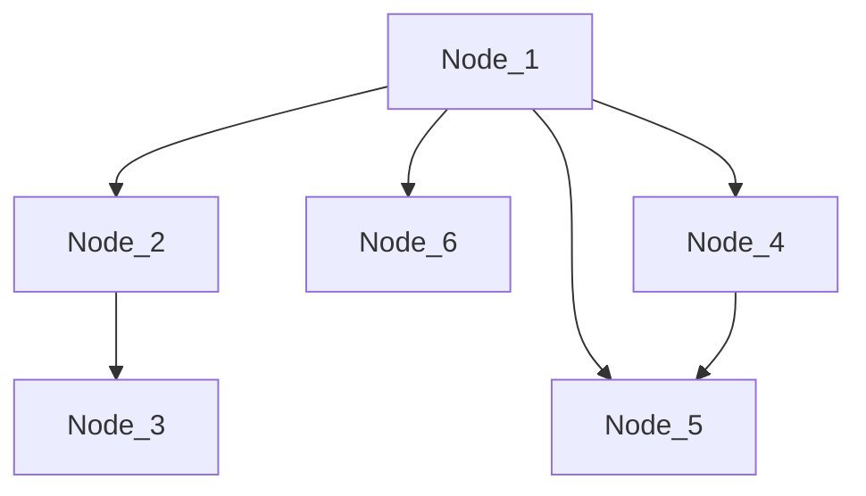
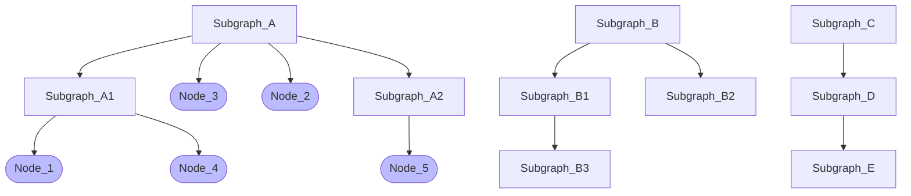
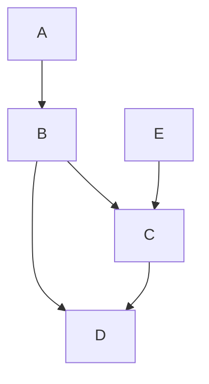
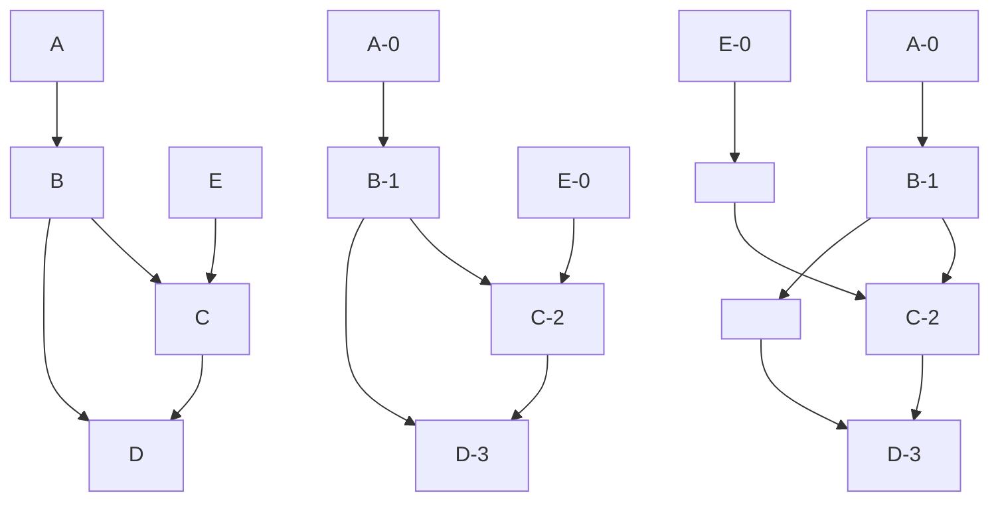

# `Sifting` layout for NetworkX graphs

This document describes the problem statement, requirements, algorithms and design goals for a new Python graph layout function for [NetworkX](http://networkx.github.io/) graphs to draw simple 2D representation of a 'hierarchical' directional acyclic graph (DAG), while optimally minimizing edge crossing, and without relying on technologies such [Pygraphviz](https://pygraphviz.github.io/) and [Graphviz](http://graphviz.org/).

There seems to be a lack of open source libraries that implement OSCM (one-sided crossing minimization) or TSCM (two-sided crossing minimization) in Python. This document covers discussions about algorithms considered to minimizing the crossing of edges in a layered graph.


**TABLE OF CONTENTS**

* [Requirements](#requirements)
* [Technologies](#technologies-used/mentioned)
* [Architectural Design](#architectural-design)
* [Implementation Details](#implementation-details)
* [Testing](#testing)
* [Project Planning](#project-planning)

## Requirements

### Challenges

**Challenge #1**

Within the Python community, [NetworkX](http://networkx.github.io/) is often used to create and manipulate directional acyclic graphs (DAGs) and [Pygraphviz](https://pygraphviz.github.io/) (AGraph class) is used to eventually draw a 2D representation (layout) of the hierarchical graph in any of the 4 cardinal directions, horizontally (left to right / right to left) or vertically (top to bottom / bottom to top).



The main issue is that [Pygraphviz](https://pygraphviz.github.io/) depends on a nonetheless very powerful and mature but overkill [Graphviz](http://graphviz.org/) technology to generate the 2D hierarchical layout using its 'dot' layout algorithm, which optimizes the placement of nodes for viewing by minimizing the crossing of edges.

Graphviz is available pre-compiled by most OS distributions (Ubuntu, Redhat, MacOS, etc.), however it is often behind by multiple minor releases. Because I ran into critical bugs (with no workarounds), it is necessary to remove the dependency on both [Graphviz](http://graphviz.org/) and [Pygraphviz](https://pygraphviz.github.io/), instead opting for a native Python function that provides the optimal layout of a NetworkX directed acyclic graph (DAG) for all nodes.


**Challenge #2**: Factor subgraphs as a constraint [WIP]

The additional complexity, which 'dot' takes care of nicely, is the concept of subgraphs, which I use today for my 2D visualization to automatically group nodes of the same type together. It supports a hierarchy of subgraphs, or in other words, nested subgraphs. This would be another constraint to factor in the algorithm, basically a set of nodes sticking closely to each other, on multiple layers, preventing subgraphs from overlapping. A subgraph is basically a graph with nodes (optionally edges), such that given a DAG graph G=(V,E,S), S is the list of subgraphs, each of which is a graph of nodes and potentially more embedded subgraphs.

> Simply by slightly modifying the sifting algorithm and recursing through the nested subgraphs, one could take this additional constraint into account. At each step, one would perform the k-layer sifting of the subgraph and then to indicate which nodes in the supergraph must remain grouped, one would assign a flag value to each node in the supergraph. The objective of this recursive approach would be to minimize each subgraphs' crossings until the full graph is reached, at which point the operation is reduced to swapping subgraphs to minimize crossings. [WIP]
>


**Hierarchy of subgraphs**: 3 examples



### Requirements

**Phase 1**: Nodes and edges

Given a NetworkX directional acyclic graph (DAG), G = (V, E), the Python function must provide the **relative position** of all its nodes in a 2D matrix of horizontal layers (1 to k) and vertical layers (1 to n), such that it provides the proper ranking of the nodes based on its position in the hierarchy and minimizes the crossing of edges between nodes.

Nodes end up positioned at the cross road of horizontal and vertical layers, which a relative layer (x,y) position of the node which should be added as an attribute to the node using NetworkX (e.g. `layer_x`, `layer_y`) (see [NetworkX attributes](https://networkx.github.io/documentation/stable/reference/functions.html?highlight=attributes#attributes)).

With the provided position of in the layer matrix, the graph can be drawn in any of the 4 cardinal directions (LR, RL, BT, TB), and scale the position of the node automatically the way I want

| Function | Data type                                                    | Comments                                                     |
| -------- | ------------------------------------------------------------ | ------------------------------------------------------------ |
| Input    | A NetworkX graph                                             | Assumed to be a DAG.                                         |
| Output   | same NetworkX graph with new layer_x , layer_y attributes added to each node, and describing the position of the node in a 2D multi-layer matrix. | User would take those 'layer' coordinates to automatically compute the actual coordinates of the nodes in the final drawing, factoring scale, node dimensions (label, rectangle, circle, else), etc. |


**Phase 2**: Factor subgraphs as a constraint [WIP]

Given a NetworkX DAG, G = (V,E,S), with S being the subgraphs in the graph, the function most provide similar functionality to phase 1 detailed above, in that it provides the relative position of all nodes, all while factoring in subgraphs as a constraint in order to keep certain nodes adjacent to one another. 


### Deterministic Output

If given the same graph, will the position of the nodes in the layered matrix be the same every time? The function should provide a deterministic output, so that the nodes can be visualized in the same position as last time the function was applied to the graph. Consistent output is preferable over speed.

> If the nodes are selected for sifting in the same order (ideally based on indegree), the result would be identical each time the algorithm is run on the same graph. However, if any nodes have identical indegrees, we would need to sift them in the same order every time the algorithm was run on the graph.
>
> If the layering algorithm always arranges nodes within the same layer in the same order, then we could choose between two nodes of the same indegree simply by their position in the graph (prioritize left to right / right to left). However, if the layering step does not always place nodes in the same order, this may be a problem as slightly different results could be produced in the case of a tie. Another potential way around this is to use the hash value of the data stored in the node to determine which node to sift first if multiple nodes have the same indegree. This would assure that the result is deterministic, operating under the assumption that the sifting is performed in the same direction with respect to layers as well as nodes.


### Short-term Goal

The goal is to "extend" NetworkX with a new layout algorithm to draw a 2D representation for hierarchical directed acyclic graphs (DAG) which minimizes edge crossing, and which does not depend on Graphviz. 


### Future Enhancements To Consider

1) If we make this function available to the community, we may want to provide an option to actually generate the x,y position (like `dot`) of the nodes and set the node `pos` attribute, which is recognized by the DOT standard as the coordinates of the node, **based on a limited set of constraints/attributes we would support** and which are recognized as DOT attributes for the graph or nodes, mainly such as `rankdir`, `ranksep` `nodesep` for the entire graph or `width` and `height` for nodes. The user would preset them as attributes to the graph itself before processing their NetworkX graph through our function. [WIP]

```json
digraph "graph_name" {
	graph [
		nodesep=.2,
		rankdir=RL,
		ranksep=1.7
	];
	node [
		fixedsize=true,
		height=0.4,
		label="DJ_Thor",
	];
}
```

For example: `pos` attribute: http://graphviz.org/doc/info/attrs.html#d:pos


## Technologies Used/Mentioned

[NetworkX](http://networkx.github.io/)  is an open source Python library, released in 2005 and still very well-maintained (version 2.5 released in August 2020)

[Pygraphviz](https://pygraphviz.github.io/) is an open source Python library (Agraph class) which provides a Python interface to the [Graphviz](http://graphviz.org/) graph layout and visualization package. With PyGraphviz you can create, edit, read, write, and draw graphs using Python to access the Graphviz graph data structure and layout algorithms.

[Graphviz](http://graphviz.org/) offers a graph data structure and a multitude of layout algorithms. dot, neato are some of the most popular graph tools used to create the layout of the graph, which can generate a image of the graph or just provide the coordinates of the nodes and edges of the graph

The [DOT](https://graphviz.org/doc/info/lang.html) language is used to describe graphs and is the one of the standards for graph description. It is compatible with Graphviz and commonly-used programs such as dot and neato. DOT supports various types of graphs with different attributes. These graphs can then be stored in files with extensions `gv` or `dot` . 

 


## Architectural Design

This section discusses about the proposed architecture.

**Goal** ==> Order nodes on each layer, so that the number of edge crossing is minimized.


### Sugiyama Framework

Proposed steps, inspired by the Sugiyama Framework (Sugiyama, Tagawa, Toda 1981)

| Step | Name                            | Description                                                  |
| ---- | ------------------------------- | ------------------------------------------------------------ |
| 1    | Resolve cycles                  | Checks the graph for cycles and flips the directions of the fewest possible edges in order to resolve (remove) all cycles and create a DAG. |
| 2    | Assign layers                   | Assigning nodes across **horizontal layers** based on position in the hierarchical DAG. Layer 1 being the topmost root node(s) and layer k, being the leaf node(s) the deepest in the hierarchy. |
| 3    | One-Sided Crossing minimization | Traverse nodes iteratively across all layers, 2 layers at a time, starting from the leaf nodes. Within a layer, begin with the nodes with greatest indegree and sift each until an optimal ordering is reached. |
| 4    | Straightening edges             | Position nodes across vertical layers, to minimize deviation from a straight line for edges with dummy nodes (added in layering process to allow for edges between nodes in non-adjacent layers). Remove dummy nodes at the end. |
| 5    | Edge drawing                    | Planning to skip this steps assuming that the draw tool will take care of this based on the position and size of the nodes. |


### References

- [Algorithms for Graph Visualization](https://i11www.iti.kit.edu/_media/teaching/winter2019/graphvis/graphvis-ws19-v11.pdf) (Karlsruhe Institute of Technology, Jan. 2020)
- [Using Sifting for k-Layer Straightline Crossing Minimization](https://link.springer.com/content/pdf/10.1007%2F3-540-46648-7_22.pdf) (University Halle-Wittenberg, 1999)
- [An Efficient Implementation of Sugiyama’s Algorithm for Layered Graph Drawing](https://link.springer.com/content/pdf/10.1007%2F978-3-540-31843-9_17.pdf) (2004)
- [Hierarchical Drawing Algorithms](http://cs.brown.edu/people/rtamassi/gdhandbook/chapters/hierarchical.pdf) (Brown University, 2013)
- [Sugiyama Algorithm](https://www.researchgate.net/publication/303226437_Sugiyama_Algorithm) (University of Limerick, January 2016)
- [Layered Graph Drawing for Visualizing Evaluation Structures](https://www.computer.org/csdl/magazine/cg/2017/02/mcg2017020020/13rRUB6SpUK) (Kyoto University, April 2017)
- [Radial Adaptation of the Sugiyama Framework for Hierarchical Graph Drawing](https://citeseerx.ist.psu.edu/viewdoc/download?doi=10.1.1.71.2000&rep=rep1&type=pdf) (University of Passau, April 2006)
- [Efficient Computation of Feedback Arc Set at Web-Scale](http://www.vldb.org/pvldb/vol10/p133-simpson.pdf) (University of Victoria, 2016)


### Sifting Algorithm Overview

This section evaluates the benefits and limitations of using the sifting approach for k-layered straight-line crossing minimization 

* [Using Sifting for k-Layer Straightline Crossing Minimization](https://link.springer.com/content/pdf/10.1007%2F3-540-46648-7_22.pdf) (1999)


This is a significantly faster heuristic for all densities of graphs than the Barycenter & Median detailed in the presentation [Algorithms for Graph Visualization](https://i11www.iti.kit.edu/_media/teaching/winter2019/graphvis/graphvis-ws19-v11.pdf) (Karlsruhe Institute of Technology, Jan. 2020).

This heuristic is known as sifting and is adapted from BDDs, and seems to work relatively well. In essence, it handles "step 3" (detailed below) of the process by considering two layers at a time and considering one node at a time in each layer. It then places the node at one end of the layer, and "sifts" it through the layer by swapping it progressively with each node in the layer, calculating the crossings in the layer by taking the total crossings before the swap, subtracting c<sub>uv</sub>, and adding c<sub>vu</sub>. After the other end of the layer is reached, the node is placed at its optimal location. Thus, the sifting of one node is an O(n) process repeated for each node in the layer, giving it a runtime of O(n<sup>2</sup>) where n is the number of nodes in the layer. This process is then repeated for all the layers, hence the name k-layer sifting. 


## Implementation Details

*In this section, can we document the functional steps for each main steps (1 to 4) here, in as much details as possible, using English words?*

| Sub-section             | Description                                                  |
| ----------------------- | ------------------------------------------------------------ |
| 1. High-level algorithm | Plain English, the main concepts, the steps, flow, structure, visual diagrams, input/output, and may be why. |
| 2. Detailed algorithm   | Not-code but starts to shape the structure of the expected logic, input/output. |
| 3. Code snippets        | Preliminary code, not tested, not final. May require to rethink the logic of the corresponding detailed algorithm. |


----

### High-level algorithm


#### Step 1: Resolve cycles

In order to resolve cycles (remove minimal edges such that a DAG is created), one would need to find a Feedback Arc Set (FAS) for the given graph. In graph theory, a FAS is a **set of edges such that, when removed, leaves an acyclic graph**. There are many such sets for a given graph, so the objective of this process would be to remove minimal edges (maintaining the graph's integrity) while making the graph acyclic. This problem cannot be solved exactly in polynomial time, so an approximation must be used. For this implementation, we used a GreedyFAS algorithm. The idea behind this algorithm is to simplify the FAS problem. In order to find the FAS, one method is to find what is known as the Linear Arrangement (LA) of the graph. The LA determines an ordering of nodes such that the edges pointing "backwards" (i.e. right to left) are minimized. If these backwards edges are then removed, the directed graph becomes acyclic, as by definition, the if edges only point "forward" from one node to the next, the graph is acyclic. This LA-finding algorithm works as follows:

1. Define a "sink" node to be one with outdegree 0, and a "source" node to be one with indegree 0
2.  Let δ be the difference between the outdegree of a node and the indegree of the same node
3. While the graph contains a sink node, choose one of these nodes and prepend it to a sequence  `seq2`
4. Remove the sink node from the graph and re-compute the sink nodes and source nodes present in the graph
5. Then, when no more sink nodes are in the graph, while the graph contains any source nodes choose one of these and append it to another sequence  `seq1`
6. Once again, remove the source node from the graph and recalculate any sink nodes and source nodes
7. Once all the source nodes are exhausted, if any nodes remain, choose a node for which δ is maximized, and then append this node to `seq1` 
8. Once again, remove this node from the graph and identify any new sink and/or source nodes formed
9. Repeat steps 3-8 while the graph still has nodes, return  `seq1 + seq2`

Then, iterate through the LA list and remove all "backward" edges from the graph


#### Step 2: Assign horizontal layers

The horizontal layer of a node corresponds to its rank or hierarchy depth in the graph, assumed to be a directed acyclic graph (DAG) at this point. In a DAG, nodes are effectively in a ***hierarchical order*** or tree structure, with root, intermediate and leaf nodes. When the directed graph is acyclic, there are no edges that would allow to LOOP BACK through nodes higher in the hierarchy.

* **Root** nodes are nodes with only edges directed to other nodes and not the way around.
* **Intermediate** nodes have edges directed in both directions, to and from other nodes.
* **Leaf** nodes are only linked to other nodes with an edge directed to them only, and no edges from other nodes.

Example of a hierarchical directed graph described in the DOT language:

In the DOT language, the directed graph is called a `digraph`.

```
digraph {
    A -> B -> C -> D
    B -> D
    E -> C
}

Node types in this example:
  root: A, E
  intermediate: B, C
  leaf: D
```



**Determining the `hierarchy depth`**

At a high level, the steps should be:

The  `hierarchy depth` of each node in the graph, is determined based on the rank of the deepest nodes in the graph (leaf nodes). It will have to be done in 2 passes:

* **Pass 1**: Traverse the graph to apply the hierarchy depth, incrementing every successor of a node starting from root nodes (depth 0) which are nodes with no predecessors, all the way down to the leaf nodes.
* **Pass 2**: Traverse the graph the other direction, starting from the leaf nodes (nodes with no successors) and adding dummy nodes such that no edges between nodes on non-adjacent layers are present.



At this point we have the proper hierarchy depth set for all nodes based on their distance from each other.

This becomes the new starting point for setting the rank each subgraph will end up with through Step 3 and Step 4.


#### Step 3: One-Sided Crossing minimization

[WIP]

#### Step 4: Straightening edges

[WIP]

----

### Detailed algorithm


#### Step 1: Resolve cycles

```markdown
WIP
```


#### Step 2: Assign horizontal layers

**Pass 1**: Traverse the graph to apply the hierarchy depth from the **root nodes** down to the **leaf nodes**

```markdown
Get the list of all the nodes with no `predecessors` (root nodes) --> list of root nodes

node_list = list of root nodes

Function_pass1 (hierarchy_depth = 0, node_list):
		FOR each node from the node list:
				set the node.hierarchy_depth to hierachy_depth 
    		node_list = list of successors for this node
    		child_hierarchy_depth = hierarchy_depth
    		recursively Function_pass1 (child_hierarchy_depth, list of successors)

```

**Pass 2**: Traverse the subgraph graph starting from the **leaf nodes** with the deepest rank, adding dummy nodes wherever necessary to ensure that no edges are present between nodes which are not ranked adjacently from pass 1 

```markdown
Get the list of all the nodes with no `successors` (leaf nodes) --> list of leaf nodes

node_list = list of leaf nodes

For each node in node_list:
		parent_hierarchy_depth = node.hierarchy_depth
	  	parent_list = list of predecessors for this node
		Function_pass2 (parent_hierarchy_depth, parent_list )
		
Function_pass2 (parent_hierarchy_depth, node_list)
		FOR each node from node_list:
   			IF node.hierarchy_depth != parent_hierarchy_depth + 1:
   				dummy = new dummy node
   				currParent = node.Parent
   				currParent.child = dummy
   				dummy.child = node
   				add dummy to node_list
   			parent_list = list of predecessors for this node (including added dummy node)
   			recursive Function_pass2(parent_hierarchy_depth-1, parent_list)
   				
```


#### Step 3: One-sided crossing minimization

```markdown
WIP
```


#### Step 4: Straightening edges

```markdown
WIP
```


-----

### Code snippets


The NetworkX graph to process is stored and accessible as the property `self.nx_graph` of a class called `Template_Graph`. It is initialized as followed: `self.nx_graph = nx.DiGraph()`

Note:

* Later, below, change node attribute name `hierarchy_depth` to `layer_y` (describes the position of the node across horizontal layers), where `layer_y` defines the position of the node on horizontal layers and `layer_x` the position of the node on vertical layers.

  Example of setting the attribute for a node, where g_node is a string representing the unique ID of the node in the graph.

  ```python
  
  	self.nx_graph.nodes[g_node]['layer_x'] = somevalue
    
    	self.nx_graph.nodes[g_node]['layer_y'] = somevalue
    
  
  ```

* Different ways to loop through the list of nodes belonging to a NetworkX graph, depending on whether data=[True | False ], where data=False by default.

  * Note: Best has been for me to usually cast with `list` type to prevent potential side effects/issues/crashes... I think it is because several Networks methods return an iterator type, which is a Python structure I still have to learn to use properly.

  ```python
  
  	for g_node in self.nx_graph:
      print("unique node id: {}".format(g_node))
      
    # Same as above, returns the list of node IDs (strings) without its attributes:
  	for g_node in self.nx_graph(data=False):
      print("unique node id: {}".format(g_node))
      
    # Returns both the unique node id and its attributes
    for g_node, attr in self.nx_graph.nodes(data=True):
      if 'layer_y' in attr.keys():
      	print("unique node id: {}, with layer_y = {}".format(g_node, attr['layer_y']))
  
    
    # Traversing the list of nodes without edges (if needed)
    for g_node in list(nx.isolates(self.nx_graph))
      
  ```

* Adding a node to a graph

  ```python
  
  	self.nx_graph.add_node("DJ_Thor1", layer_x=2, layer_y=5)
  
  ```

  


#### Step 2: Assigning horizontal layers

Overall (see all methods further below)

```python
import networkx as nx

    # Assuming the following property of the Template_Graph class:
  	# which contains the graph to process:
    self.nx_graph = nx.DiGraph()

    ## ...... nodes and edges have been added to the graph `self.nx_graph`

    print("[Before] List of nodes with attributes:")
    pprint.pprint(self.nx_graph.nodes(data=True), indent=2, width=40)

    # - - - - - - - - -- - - - - - - - - - - - - - - - - - - -
    # Get the list of root nodes (nodes without predecessors)
    # - - - - - - - - -- - - - - - - - - - - - - - - - - - - -

    root_nodes_list = self._get_root_nodes()

    print("Root nodes ---> {} ".format(root_subgraphs_list))

    # - - - - - - - - -- - - - - - - - - - - - - - -
    # Apply pass 1
    # - - - - - - - - -- - - - - - - - - - - - - - -
    
    self._set_hierarchy_depth_pass1(root_nodes_list)

    print("[After pass 1] List of nodes with attributes:")
    pprint.pprint(self.nx_graph.nodes(data=True), indent=2, width=40)

    # - - - - - - - - -- - - - - - - - - - - - - - - - - - - -
    # Get the list of root nodes (nodes without predecessors)
    # - - - - - - - - -- - - - - - - - - - - - - - - - - - - -

    leaf_nodes_list = self._get_leaf_nodes()
    
    print("Leaf nodes ---> {}".format(leaf_nodes_list))

    # - - - - - - - - -- - - - - - - - - - - - - - -
    # Apply pass 2
    # - - - - - - - - -- - - - - - - - - - - - - - -
    
    self._set_hierarchy_depth_pass2(leaf_nodes_list)
    
    print("[After pass 2] List of nodes with attributes:")
    pprint.pprint(self.nx_graph.nodes(data=True), indent=2, width=40)
    

```


Methods:

```python
    def _get_root_nodes(self):
        """
          Returns the list of root nodes for a directed acyclic graph (DAG), nodes without predecessors.
          Input:
          ------
              self.nx_graph: nx.Digraph() graph object, property of Template_Graph
          Returns:
          --------
            list of root nodes (list of strings)
        """

        root_nodes_list = []

        for g_node in self.nx_graph:
            node_pred = list(self.nx_graph.predecessors(g_node))
            pred_count = len(node_pred)

            if pred_count == 0:
                root_nodes_list.append(g_node)

        return root_nodes_list
```


```python
    def _set_hierarchy_depth_pass1(self, successors_list = [], parent_hierarchy_d = -1):

        for node_name in successors_list:
            hierarchy_d = self.nx_graph.nodes[node_name]['hierarchy_depth']
            if hierarchy_d <= parent_hierarchy_d:
                hierarchy_d = parent_hierarchy_d + 1
                self.nx_graph.nodes[node_name]['hierarchy_depth'] = hierarchy_d
            node_successors = list(self.nx_graph.successors(node_name))

            # Traversing its successors if any... (going deep first)
            if len(node_successors) > 0:
                self._set_hierarchy_depth_pass1(node_successors, hierarchy_d)
            else:
                app_msg = "Subgraph: '{}' - No more successors to process!".format(node_name)
                print(app_msg)
            
```


```python
    def _get_leaf_subgraphs(self):
        """
          Returns the list of leaf nodes of a directed acyclic graph (DAG), nodes with no successors
          Input:
          ------
              self.nx_graph: nx.Digraph() graph object, property of Template_Graph
          Returns:
          --------
            leaf_nodes_list: list of (strings)
        """
      
        leaf_nodes_list = []

        for g_node in self.nx_graph:

            node_successors = list(self.nx_graph.successors(g_node))
            successors_count = len(node_successors)
            
            if successors_count == 0 :
                leaf_nodes_list.append(g_node)

        return leaf_nodes_list
```


```python
    def _set_hierarchy_depth_pass2(self, children_nodes_list = [], parent_hierarchy_d = 0, child_names = None):

        # Initialize child_names as an empty list at the beginning of traversing the tree:
        if child_names == None:
            child_names = []
        
        # Go horizontal before going deeper into the graph (iow the predecessors)
        # Hence the need to loop twice...
        for node_name in children_nodes_list:
            hierarchy_d = self.nx_graph.nodes[node_name]['hierarchy_depth']
            if parent_hierarchy_d > 0:
                hierarchy_d = parent_hierarchy_d - 1
                self.nx_graph.nodes[node_name]['hierarchy_depth'] = hierarchy_d
                
            app_msg = 'Subgraph: {} ["hierarchy_depth"={}]'.format(node_name, hierarchy_d)
            print(app_msg)


        for node_name in children_nodes_list:
            # Add the node itself as a parent,
            # also in case one of the ancestor is itself (looping to itself)
            child_names.append(node_name)

            node_predecessors = list(self.nx_graph.predecessors(node_name))

            if node_name not in child_names:
                if len(node_predecessors) > 0:
                    hierarchy_d = self.nx_graph.nodes[node_name]['hierarchy_depth']
                    self._set_hierarchy_depth_pass2(node_predecessors, hierarchy_d, child_names)
                    
```


#### Step 3: One-Sided Crossing minimization

[WIP]

#### Step 4: Straightening edges

[WIP]


